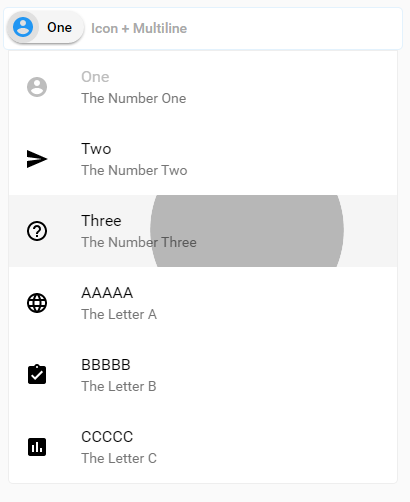

# zikes-selectbox

A dropdown selector with search, replacing `<select>`s.

## Simple Example:

```
<zikes-selectbox placeholder="Simple">
  <select multiple>
    <option value="tt0111161">The Shawshank Redemption</option>
    <option value="tt0068646">The Godfather</option>
    <option value="tt0071562">The Godfather: Part II</option>
    <option value="tt0468569">The Dark Knight</option>
    <option value="tt0110912">Pulp Fiction</option>
    <option value="tt0108052">Schindler's List</option>
  </select>
</zikes-selectbox>
```


## More Complex:

```
<zikes-selectbox placeholder="Src + Multiline">
  <select multiple>
    <option value="1" subtext="The Number One" icon="account-circle">One</option>
    <option value="2" subtext="The Number Two" icon="send">Two</option>
    <option value="3" subtext="The Number Three" icon="help-outline">Three</option>
    <option value="A" subtext="The Letter A" icon="language">AAAAA</option>
    <option value="B" subtext="The Letter B" icon="assignment-turned-in">BBBBB</option>
    <option value="C" subtext="The Letter C" icon="assessment">CCCCC</option>
  </select>
</zikes-selectbox>
```


## Effects!



## Search!


## Keyboard Accessibility!

Use `Up` and `Down` to highlight items, `Enter` to select/deselect, `Backspace` to remove items, and `Escape` to hide the dropdown.  The dropdown list automatically scrolls as necessary, too!


